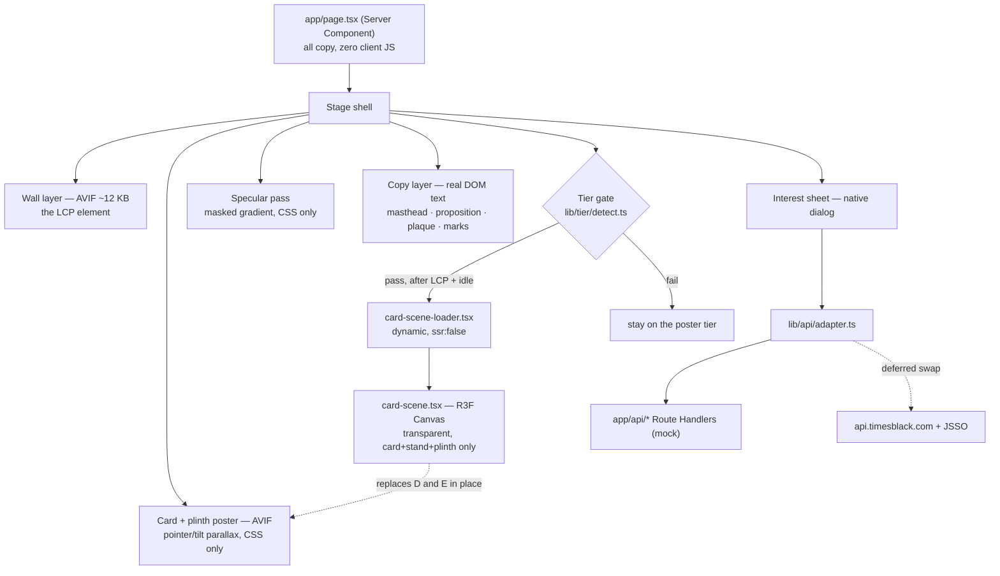
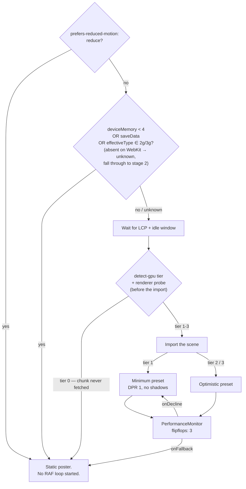
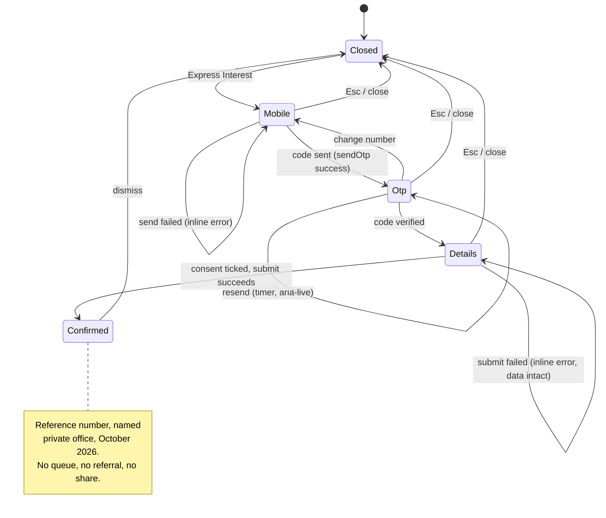

# 1838 Reserve Teaser Rebuild - Plan

## Goal Capsule

- **Objective:** A visitor arriving at the 1838 Reserve invite page believes the card is a real, expensive object before they read a word, and can register interest without the moment breaking.
- **Means:** Rebuild the single locked screen as a lit, layered, pointer-responsive scene with real DOM copy and an opt-in sound layer, and move the express-interest flow in-page (KTD1, KTD6, KTD10).
- **Authority:** Requirements (R-IDs) win on what the page must do. KTDs win on how. Visa Brand Standards and WCAG 2.2 AA are external authorities that override art direction where they conflict (KTD13, R6, R20).
- **Execution profile:** Front-end craft build. Backends are mocked behind one adapter (KTD11). No Times infrastructure credentials are needed or used.
- **Stop conditions:** Stop and ask only if the work would require shipping an uncleared Krishen Khanna reproduction to a publicly reachable deploy (OQ2). OQ1 and a failed R3F spike are not stop conditions: OQ1 falls back to layer reconstruction, and a spike that fails on Next 16.3 retries on pinned 16.2.x — failing both cuts U4 and the build ships poster-tier.
- **Tail ownership:** Standalone run. This plan owns through a deployed preview URL; it does not own production cutover.

---

## Product Contract

### Summary

Rebuild `1838reserve.com` as a single-screen teaser that earns its price tag. The page keeps its current job exactly — reveal the card, offer one CTA, collect an expression of interest — and changes only how well it does it. The card and its room become a layered, lit scene that responds to the pointer and to device tilt. Every word becomes real DOM text instead of pixels in a PNG. The interest flow moves into a native `<dialog>` sheet over the hero, so the card never leaves frame. A single adapter module stands between the UI and the network, so a Times engineer can later swap mocks for JSSO and `api.timesblack.com` without touching a component.

The deliverable is a deployable pitch-grade build: real front end, mocked backends, licence-tracked assets, and a written record of what needs clearance before it can go live.

### Problem Frame

The live page is a Times Black template with the content deleted and one PNG swapped in. That inheritance is visible in the markup and it is the reason the page does not feel premium.

Everything a visitor reads below the `<title>` — the tagline, the "Artwork by Krishen Khanna" plaque, the `₹1,75,000 + GST` fee, the Visa mark — is baked into a single 1998×2496 palette PNG. The page is therefore a picture of a website. Nothing responds, nothing is selectable, nothing is translatable, nothing scales past its raster, and 274 KB of LCP is spent rendering type that should have cost nothing. The card, whose entire job is to look like an object worth ₹1.75 lakh, never moves.

The inheritance also leaked things that are actively wrong. The page ships Times Black's complete JSON-LD payload: the `Organization` is named Times Black, `url` is the string `"undefined"` three times, and an `FAQPage` block publishes Times Black's **₹20,000** joining fee into 1838 Reserve's search results. The Visa mark is rendered in gold on a dark ground, which Visa's own standards prohibit. And the page ships a full-bleed "please rotate your device" overlay — the product asking the customer to accommodate it.

The source PNGs are 8-bit palette images with `tRNS` alpha. A gold-on-black render quantised to 256 colours has banding permanently baked in and hard-edged alpha with no soft shadow blending. No amount of front-end craft recovers from those files.

### Key Decisions

- KD1. **The page stays a single-screen teaser.** (session-settled: user-directed — chosen over a cinematic scroll story and over a gated two-act reveal: the restraint is the product, and a benefits page would turn it into Times Black.) Governs R1, R2, R3, R9.
- KD2. **Pitch-grade concept build with mocked backends.** (session-settled: user-directed — chosen over a production integration and over a staged both: the argument is won on feel, and the Times API contracts are not available.) Governs R14, R21.
- KD3. **External collateral is sourced freely and flagged for clearance.** (session-settled: user-directed — chosen over site-assets-only and over generate-everything: the existing assets are too degraded to build on.) Governs R22.
- KD4. **No new claims about the card.** The page adds no benefits, no eligibility criteria and no rankings. It adds only the disclosures the regulator requires. Governs R4, R5.

### Requirements

**The stage**

- R1. The card and its room render as a lit, layered scene that responds continuously to pointer position, and to device tilt where the platform grants it.
- R2. The hero composes as one deliberate frame from 320 px to 3840 px, in both orientations, with no rotate-your-device prompt.
- R3. A ceremonial load reveal runs once, completes within 5 seconds measured from navigation start (font gate included), and settles into a state driven only by the user.

**Copy and compliance**

- R4. Every word on the page is real, selectable DOM text. No copy is baked into an image or a canvas texture.
- R5. The joining fee `₹1,75,000 + GST` and a terms reference are present in visible text on the first screen.
- R6. The Visa Brand Mark renders in white at full opacity, never blurred, cropped, tinted or obscured, with clear space of 1X on all sides; the card image holds still for at least one second in any animation.
- R7. ICICI Bank is named as the issuer in legible text, not by logo alone.
- R8. Structured data describes 1838 Reserve only. No Times Black entity, fee, FAQ or video metadata survives.
- R23. The page ships complete Open Graph and Twitter Card metadata with a share image built from the new hero art — the invite link's first impression is a WhatsApp/iMessage preview.

**The approach**

- R9. Express Interest opens in place over the hero. The card stays in frame and the URL does not change.
- R10. The mobile step takes a 10-digit Indian number behind a non-editable `+91`, and rejects a first digit outside 6–9.
- R11. The OTP step uses one real input painted as six slots, with `autocomplete="one-time-code"`, working paste including partial paste, and never `opacity: 0`.
- R12. The details step presents the existing field set on one screen with real labels, an unticked consent box, and inline validation on blur.
- R13. The confirmation reads as an artifact, not a receipt: a reference number, a named private office as the reply-from, and October 2026 stated as the supply constraint. No queue position, no referral prompt, no social share.
- R14. Every network call passes through one adapter module. Replacing the mocks with Times endpoints is a transport-level change touching no component file; reCAPTCHA and JSSO auth-state UI are the named exceptions owned by the production integration.

**Craft systems**

- R15. Type is self-hosted, subset to the copy actually used, and licence-clean. The hero reveal is gated on `document.fonts.ready` raced against a 2-second timeout.
- R16. Sound is muted by default, opts in on a user gesture, exposes a visible control early in tab order, and recovers from the iOS `interrupted` audio state.

**Performance and accessibility**

- R17. The LCP element is a server-rendered ``. In lab runs on the reference-device profile the page holds LCP ≤ 2.5 s and CLS ≤ 0.1, TBT stays within `lib/budget.json`, and a scripted Express Interest open completes under 200 ms; the p75 field targets (LCP 2.5 s / INP 200 ms / CLS 0.1) are recorded in the README as the launch goal, since a zero-traffic preview has no field data.
- R18. Critical-path JavaScript stays under 307 KB compressed. The WebGL tier loads only after LCP and only on devices that pass the tier gate.
- R19. Under `prefers-reduced-motion: reduce` the render loop does not start and the page shows a static poster.
- R20. The page meets WCAG 2.2 AA. The interest sheet is fully operable by keyboard and screen reader, including focus restoration to the trigger on close.

**Build and delivery**

- R21. The page is statically prerendered and deploys on Vercel with server-side mock Route Handlers (`output: 'export'` intentionally unused); content-hashed hero assets are served `immutable`.
- R22. No trial-licence, personal-use-only or uncleared third-party asset ships to any publicly reachable deploy; on the access-protected preview, uncleared assets are permitted only when red-flagged in the register with an owning open question. Every third-party asset is recorded with its source and licence in `docs/asset-register.md`.

### Success Criteria

- A viewer who has seen both pages side by side on a mid-tier Android cannot tell which one is "the cheap one" from motion smoothness alone — both are smooth; only one is alive.
- The page passes a Visa brand-standards read and a WCAG 2.2 AA audit without art-direction rework.
- The adapter contract is derived from the `api.timesblack.com/gw/` call shapes captured in `reference/source-site/`, so a Times engineer swaps mocks for real endpoints as a transport-level change — reCAPTCHA and JSSO auth UI being the two named component-level exceptions.

### Scope Boundaries

**In scope:** the single teaser screen, the four-step interest flow, the opt-in sound layer, the asset pipeline, the mock backend, and an access-protected deployed preview.

**Deferred to follow-up work**

- Production integration with JSSO, reCAPTCHA, GrowthRx and `api.timesblack.com`.
- A flag to the live page's owning team, worth raising now: the Times Black JSON-LD on `1838reserve.com` (₹20,000 fee, `"undefined"` URLs) warrants an immediate hotfix independent of this rebuild.
- `/tnc` and `/privacy-policy` — carried over as-is; not redesigned here.
- Cloudflare R2 asset hosting. Justified only by launch-spike traffic, which this build does not have (KTD12).
- Bilingual Devanagari treatment of the plaque. Real option, but it needs a brand decision first.

**Outside this product's identity**

- A benefits grid, rewards calculator, eligibility checklist, partner logo wall, or spender leaderboard. These are Times Black's grammar and the reason its page reads as a product listing rather than an invitation.
- Any scarcity mechanic: queue counters, referral-to-skip-the-line, countdowns. Beyond taste, CCPA Dark Patterns Guidelines 2023 make fabricated urgency an enforcement risk in India, and RBI's advertising amendment (effective 1 Jan 2027) targets the same shapes.
- Self-conferred superlatives. Genuinely exclusive brands do not rank themselves.

### Open Questions

- OQ1. **Blocking for the highest-fidelity hero.** Can ICICI/TIL supply the original card render — the source Blender/Octane project or a layered PSD/EXR at full bit depth? The shipped PNGs are 256-colour indexed and cannot be repaired. U1 proceeds on a reconstructed fallback if the answer is no; the WebGL tier (U4) removes the dependency entirely, which is a second argument for building it.
- OQ2. **Blocking before any public deploy.** Which Krishen Khanna painting is on the card, who owns it, and what rights were licensed — physical card only, or marketing too? Khanna is alive; copyright runs past 2086 and there is no collecting society, so the licence can only come from the artist directly. Moral rights under s.57 of the Copyright Act cannot be assigned, and cropping, gold-tinting, perspective-warping and overlaying type on the work are exactly the acts s.57 reaches. Deferred for the internal pitch; blocking for launch.
- OQ3. Deferred. Which Visa tier is 1838 Reserve? Infinite and Signature carry different mandatory card-face lockups (R6).
- OQ4. Deferred, but with lead time. Can the SMS aggregator get a DLT template approved carrying the `@1838reserve.com #<code>` suffix? Without it both iOS AutoFill and Android WebOTP are permanently unavailable. Not needed for the mock, needed before launch.
- OQ5. Deferred. Has DEPwD notified the mandatory accessibility rules directed by the Supreme Court in *Rajive Raturi v. UoI* (8 Nov 2024)? Decides whether R20 is a statutory duty or a compliance-team expectation. Build to AA either way.
- OQ6. Deferred, needs a business owner. Who is the named private office on the confirmation (R13), and who signs off the October 2026 timing claim? Until named, the build uses placeholder copy marked as such in the component.

### Sources

- `reference/source-audit.md` — teardown of the live page: baked-copy PNG, palette depth, JSON-LD staleness, type stack, colour ramp, recovered field set.
- `reference/source-site/` — captured HTML, JS chunks, CSS. The applicant field set and OTP copy in R11/R12 were recovered from `chunks/page-cd04cd20d7c17f7b.js`.
- Visa Brand Standards, Marketing Outreach and Digital Card Standards, September 2025 — `corporate.visa.com/content/dam/VCOM/corporate/about-visa/documents/`. Source of every constraint in R6 and KTD13, including the ≥1 s hold and the white-on-dark rule.
- Alex Russell, "The Performance Inequality Gap, 2026" — reference device (Galaxy A24 / Helio G99) and the 307 KB JS-light budget in R18.
- Poly Haven licence (`polyhaven.com/license`) — CC0 confirmation for HDRIs and PBR textures, with the carve-out that their preview renders are not CC0.
- WICG Origin-Bound One-Time Codes; `web.dev/articles/sms-otp-form` — the single SMS format serving both iOS AutoFill and Android WebOTP (R11, OQ4).
- WCAG 2.2, now ISO/IEC 40500:2025. Technique C39 (`prefers-reduced-motion`) is sufficient for SC 2.3.3 (AAA) only, not SC 2.2.2 (A) — which is why R3 caps the reveal at 5 s rather than relying on the media query.

---

## Planning Contract

### Key Technical Decisions

- KTD1. **The layered composite is the default hero. Real-time WebGL is a post-LCP upgrade tier, not the baseline.** This reverses the lean carried into planning. Three findings drove it. `<canvas>` is not an LCP candidate at all, so a WebGL hero silently hands LCP to whatever text or image is next largest. R3F's floor is 261–324 KB gzip — the entire 307 KB JS-light budget for the reference device, spent on libraries before one pixel of the card. And the pre-rendered-sequence alternative that would normally arbitrate this does not apply, because a single locked screen has no scroll to scrub against. Meanwhile the existing composition is already two layers (the pedestal PNG carries alpha over the Khanna wall), so a layered parallax is nearly free. An autonomous pre-rendered video loop (no scroll needed; `<video>` is an LCP candidate) was also weighed as the default-tier motion source: it delivers fixed motion rather than pointer response and must clear the Visa ≥1 s still hold and 10-bit banding on dark gradients — it stays the fallback if the post-U3 aliveness checkpoint fails, not the default. Governs R1, R17, R18.
- KTD2. **When the WebGL tier loads, it renders only the card, stand and plinth into a transparent canvas over the CSS/AVIF wall.** Halves GPU fill cost, keeps the 12 KB wall as a plain image so it can be the LCP element, and lets the wall paint instantly. Cites R17.
- KTD3. **`WebGLRenderer`, not WebGPU.** WebGPU is genuinely ready — 84% global, iOS Safari 26+, automatic WebGL2 fallback — but `three/webgpu` costs 215 KB gzip against 134 KB, and the auto-fallback means shipping both backends to everyone. A static gold card needs no compute and no draw-call scaling. Cites R18.
- KTD4. **WebGL asset and colour pipeline: Neutral tone mapping, a self-hosted gainmap environment, meshopt geometry, no KTX2.** Four linked choices. R3F's `<Canvas>` silently overrides the renderer default to `ACESFilmicToneMapping`, the operator known for desaturating product renders — set `NeutralToneMapping` explicitly or the gold will not read as gold. Never ship drei's `<Environment preset>`: it fetches 1.68 MB from a third-party CDN on the critical path, which is unacceptable on a bank-adjacent page; a self-hosted 2k gainmap JPG is roughly 11× smaller than 2k RGBE. Use meshopt (6.9 KB decoder) over Draco (59 KB) on a mesh this simple. Skip KTX2 entirely — its 217 KB transcoder is larger than the four 1024² textures it would decode. Cites R18.
- KTD5. **Motion: `LazyMotion` for the sheet only; native CSS and WAAPI everywhere else; no smooth-scroll library.** The sheet needs React unmount orchestration, which is where hand-rolled exit animations die — that is worth 6.4 KB critical plus 14 KB deferred. The hero reveal is a keyframe timeline and costs nothing. Lenis is 5.4 KB with nothing to smooth on a single screen, and its touch layer fights the sheet's scroll containment. One trap to avoid: Motion's independent transform props (`x`, `scale`, `rotate`) compile to CSS variables and are **not** compositor-accelerated — animate a full `transform` string. Governs R18.
- KTD6. **The sheet is a native `<dialog>` opened with `showModal()`.** Buys top-layer placement, `::backdrop`, automatic inertness of the rest of the page, correct nested-Escape handling and modal semantics for free. Two caveats: `closedby` is absent from Safari and iOS Safari, so tap-outside dismissal needs a feature-detected JS fallback; and focus restoration to the trigger on close remains ours. Governs R9, R20.
- KTD7. **One real OTP input painted as six slots.** Six separate inputs quietly lose SMS autofill, partial paste, undo, word-delete and half of screen-reader support. `autocomplete="one-time-code"` only means anything on a single field. Critical iOS detail: the input must keep `opacity: 1` with transparent text and caret colours — iOS will not paste into an invisible input. Governs R11.
- KTD8. **Three-stage device tiering — stages 1 and 2 both run before the scene download.** Stage 1 is synchronous and pre-render: `prefers-reduced-motion`, then `deviceMemory < 4 || saveData || effectiveType ∈ {slow-2g, 2g, 3g}`; on WebKit these Chromium signals are all absent, so absence reads as unknown, not pass — iOS falls through to stage 2 rather than skipping the gate. Stage 2 runs after LCP plus an idle window, before the dynamic import: `@pmndrs/detect-gpu` v6 with self-hosted benchmarks plus a cheap WebGL-context renderer probe; tier 0 means the scene chunk is never fetched. Stage 3 is `<PerformanceMonitor>` with `flipflops: 3`, the only stage that catches thermal throttling — the second minute of every session on a 4 GB Android in an Indian summer. Two traps: `hardwareConcurrency` does not discriminate (iOS always returns 4, every mid-Android returns 8), and `<AdaptiveDpr>` does not detect slow frames — it reacts to a manual `regress()` call. Governs R18, R19.
- KTD9. **Typography: keep Bodoni Moda for the numerals, replace Raleway, self-host everything as subset variable fonts.** Bodoni Moda is the correct free didone for "1838" and is already the brand's. Raleway on every button and label is the single loudest tell that this is not a luxury product; replace it with a restrained grotesque. Self-host via `next/font/local` rather than the Google loader — Turbopack has open build failures fetching Google Fonts on 16.2.x, and subsetting control is the point. Three sizing traps: passing a `weight` array to a variable family makes Google return the full file twice; `opsz` costs +51% and is excluded by default; italic doubles the payload. A clamped variable font now beats two static instances (17.0 KB vs 19.7 KB, one request fewer). Use `font-display: block` with a reveal gate, not `swap` — `swap` guarantees the FOUT that ruins a ceremonial load. Governs R15.
- KTD10. **Audio: raw Web Audio in about a hundred lines, Opus-in-WebM with an AAC-in-M4A fallback, loaded only after the unlock gesture.** Howler has had no release since September 2023, carries 415 open issues, and its iOS unlock logic predates the iOS 17 fix. `AudioContext` has four states, not three — `interrupted` fires every time an iOS user backgrounds the tab, and code checking only for `suspended` dies silently. Do not ship the silent-`<audio>` mute-switch hack; WebKit fixed that in 2024 and the hack now just spawns spurious lock-screen controls. Leave the audio session at `ambient` so the page never stops the user's own music. MP3 is disqualified — it cannot loop gaplessly. Governs R16.
- KTD11. **One adapter module is the only thing that knows about the network; mocks are stateless Next Route Handlers.** Route Handlers over MSW because a pitch build wants fewer moving parts and this one deploys to Vercel unchanged. Stateless because Vercel functions share no memory across instances — flow progress must never depend on module state; fixed codes, deterministic reference numbers, and reserved magic inputs carry the failure paths. The adapter's types are derived from the captured `api.timesblack.com/gw/` call sites, so the swap is a base-URL and a body-mapping change. Governs R14.
- KTD12. **Vercel Pro, plain `next build`, `images.unoptimized: true`, content-hashed assets with explicit immutable headers.** Three traps this avoids. Next 16 defaults `next/image` to `formats: ['image/webp']`, so pre-encoded AVIF gets transcoded *down* to WebP — paying to inflate our own bytes. Vercel's default `Cache-Control` on `/public` is `max-age=0, must-revalidate`, so the browser revalidates every load. And Hobby is not licensed for commercial use. Avoid `output: 'export'` so response headers stay available. Vercel Deployment Protection stays enabled, with shareable links issued to the pitch audience — "private preview" means protection enforced, never URL secrecy. Governs R21, R22.
- KTD13. **Visa's standards are a constraint on the motion design, not a review step afterwards.** The mark is white on this ground — a gold Visa mark is prohibited, which the live page already violates. Depth-of-field blur across the mark is an explicit "never", so the card cannot sit in shallow focus. Any animation must land a still hold of at least one second on the card image. If the art direction ultimately wants the mark smaller than legibility allows, the escape hatch is naming the full Visa product in text instead. Governs R6.

### High-Level Technical Design

**Render tiers.** The default path has no 3D dependency at all. The WebGL scene is a leaf that can be removed without the page changing shape.

**Tier gate.** Stage 1 is the only stage that avoids the download, so it runs before anything is requested.

**Interest flow.** Four states in one dialog. The card stays visible behind all of them.

### Assumptions

- The pitch is shown on a private preview URL, not a public domain. This is what makes OQ2 deferrable rather than blocking — a public deploy would need the Khanna licence first.
- The applicant field set recovered from the live bundle is the correct one. It is reproduced rather than redesigned, because changing what the bank collects is not this plan's call.
- "Express Interest" survives as the CTA verb. It is already the right register; the plan protects it rather than improving it.
- Traffic during the pitch phase is negligible, which is what makes Vercel-only hosting acceptable (KTD12) and the Cloudflare R2 asset-hosting deferral safe.

### Risks & Dependencies

| Risk | Why it bites | Mitigation |
| --- | --- | --- |
| R3F 9.7 declares `react: ">=19 <19.3"`; Next 16.3.1 vendors a `19.3.0-canary` for the App Router | Install-time peer check passes, runtime resolves to the canary. Same class as a known Next 15 issue. No confirmed break on 16.3.1, but unverified | U1 spikes it in 20 minutes before any WebGL work is committed. Fallback: pin Next 16.2.x |
| Source renders unavailable (OQ1) | The shipped PNGs are 256-colour indexed; banding cannot be removed | Reconstruct layers from `reserve-og-img.jpg` for the poster tier, and let the WebGL tier (U4) render the card from geometry so it needs no source render at all |
| Khanna licence (OQ2) | Moral rights under s.57 cannot be assigned, and the design's crop / tint / warp are precisely the acts it reaches | Keep the artwork treatment reversible: the wall is one layer and the inlay is one texture, both swappable. Do not bake the artwork into composited assets |
| Decoded-frame memory on iOS | Decoded frames are RGBA8 regardless of source codec; iOS Safari's canvas ceiling is around 224–256 MB | Not applicable to the chosen design — KTD1 uses a handful of layers, not a frame sequence. Recorded so the sequence approach is not reintroduced casually |
| `@pmndrs/detect-gpu`'s benchmark data stopped updating in Dec 2025 | Devices launched since fall through to `FALLBACK`, and its tier 2 lumps a Poco M4 Pro with a Redmi K50 | Treat detect-gpu as a coarse gate only. Stage 3 runtime measurement is what actually protects the experience |
| Safari ignores `ascent-override`, `descent-override` and `line-gap-override` | Three of the four metric-override descriptors `next/font` emits are inert on iPhone, so the automatic CLS defence mostly is not there | Gate the reveal on `document.fonts.ready` (R15) rather than relying on fallback metrics; hand-place `size-adjust`, the one descriptor Safari honours |
| RBI advertising amendment effective 1 Jan 2027 | Bans false urgency and hidden fees; the card launches Oct 2026, inside the campaign's life | R5 carries the fee from day one rather than retrofitting it in December |

### Sequencing

U1 and U2 are foundational and unblock everything. U3 is the pitch-critical unit — if only one unit shipped, it would be this one. **Checkpoint after U3:** review the poster tier side-by-side against the live page on the actual pitch devices (including a mid-tier Android) and record a go/no-go on the "alive" read before U5–U8 proceed; if it fails, KTD1's video-loop fallback is the next candidate. U4 is a genuine upgrade tier and can be cut without the page degrading. U7 establishes the adapter contract; U5 and U6 then build the flow against it. U8 and U9 close.

---

## Implementation Units

### U1. Scaffold, asset pipeline, and the R3F spike

- **Goal:** A running Next 16 app with a build-time asset encoder, a measured performance budget, and a verified answer on whether R3F works on this Next version.
- **Requirements:** R21, R18
- **Dependencies:** none
- **Files:** `package.json`, `next.config.ts`, `tsconfig.json`, `vercel.json`, `app/layout.tsx`, `app/page.tsx`, `app/globals.css`, `scripts/encode-assets.mjs`, `lib/budget.json`, `docs/asset-register.md`, `e2e/smoke.spec.ts`
- **Approach:**
  1. Scaffold Next 16.3.1 on React 19.2.8, TypeScript, Tailwind v4. Turbopack is default and stable — do not pass `--turbopack`. Note that `next lint` is removed and `next build` no longer prints First Load JS, so bundle size needs its own check.
  2. Set `images: { unoptimized: true }` and add `vercel.json` headers giving content-hashed assets under `public/stage/` `max-age=31536000, immutable` (KTD12). Enable Vercel Deployment Protection on the project; pitch access is granted via shareable links, never by disabling protection.
  3. Write `scripts/encode-assets.mjs`: SVT-AV1 via ffmpeg, 10-bit, emitting responsive AVIF at 1080/1440/1920 with a WebP fallback. 10-bit costs about 3% and removes the banding on dark gradients, so it is not optional here.
  4. Spike R3F 9.7 + drei on this Next version: a spinning box through `next build && next start`. Record the result in the unit's commit message. If it fails, pin Next 16.2.x before proceeding.
  5. Seed `docs/asset-register.md` with the columns U9 will audit against: asset, source URL, licence, clearance flag.
- **Patterns to follow:** the three-file dynamic-import shape that U4 depends on — Server Component page, `'use client'` loader with `dynamic(..., { ssr: false, loading })`, `'use client'` scene. `ssr: false` is still unsupported in Server Components.
- **Execution note:** Run the R3F spike first. It is the cheapest thing in the plan that can invalidate a later unit.
- **Test scenarios:**
  - `pnpm build` succeeds and the route prerenders as static.
  - The encoder, run against `reference/assets/cardPedestalText.png` (1998 px wide, so no upscaling), emits AVIF at all three widths with pinned quality settings, and each is smaller than the corresponding WebP.
  - An unauthenticated request to the deployed preview receives Vercel's auth challenge, not the page.
  - A smoke test loads `/` and asserts a 200 with the `<h1>` present in the server-rendered HTML.
  - Deployed preview returns `cache-control: public, max-age=31536000, immutable` on a hashed asset in `public/stage/`.
- **Verification:** the app builds and deploys to a Vercel preview; the spike's outcome is written down.

### U2. Art direction system

- **Goal:** The tokens, type, and motion vocabulary the rest of the build composes from.
- **Requirements:** R15, R4
- **Dependencies:** U1
- **Files:** `app/globals.css`, `lib/fonts.ts`, `public/fonts/`, `styles/tokens.css`, `components/system/grain.tsx`, `docs/asset-register.md`
- **Approach:**
  1. Port the brand ramp as tokens: `#ffe4ab` primary, `#ebd5b3 / #e9c693 / #c5a265 / #aa7d4b` ramp, `#1c0e0b` warm near-black ground. Check `#aa7d4b` and `#5f5f5f` against their backgrounds — those two are the contrast failures waiting to happen (R20).
  2. Self-host Bodoni Moda (numerals and display) via `next/font/local`, subset to the glyphs actually used including `₹`, with the `wght` axis clamped. Omit any `weight` array. Replace Raleway with a restrained grotesque for UI (KTD9). Subsetting runs in `scripts/subset-fonts.mjs` (pyftsubset/fonttools) beside the asset encoder, with the glyph set checked into the script — and verify Bodoni Moda actually covers U+20B9 before committing it to the fee line.
  3. Set `font-display: block` and implement the reveal gate: hero copy at `opacity: 0` behind a `.fonts-ready` class, flipped on `document.fonts.ready`, raced against a 2000 ms timeout so a font failure cannot hold the page hostage. The reveal timeline is capped so gate plus animation stay inside R3's five seconds from navigation start.
  4. Adopt one easing vocabulary: a single deceleration curve, no springs, no overshoot. Nothing in this page bounces.
  5. Apply `text-box: trim-both cap alphabetic` for optical alignment, and `text-wrap: balance` on the proposition. Both degrade to a pixel or two of leading where unsupported. Note `balance` is silently ignored past six lines in Chrome.
- **Patterns to follow:** hand-place `size-adjust` on the fallback face — it is the only metric override Safari honours.
- **Test scenarios:**
  - Font files served from the app's own origin; no request to `fonts.googleapis.com` or `fonts.gstatic.com` in a network trace.
  - Subset file for the display face is under 20 KB.
  - With fonts blocked at the network layer, hero copy still becomes visible within 2.5 s.
  - Every foreground/background token pair in `tokens.css` meets 4.5:1, or 3:1 where the text is large; assert this in a unit test over the token map.
  - `document.fonts.ready` resolving flips `.fonts-ready` exactly once.
- **Verification:** a type specimen route renders every text style with no layout shift on font swap.

### U3. The stage — layered hero, light, and real copy

- **Goal:** The default hero: a lit, layered, pointer-responsive scene with every word as DOM text and the brand marks compliant.
- **Requirements:** R1, R2, R3, R4, R5, R6, R7
- **Dependencies:** U1, U2
- **Files:** `components/stage/stage.tsx`, `components/stage/layers.tsx`, `components/stage/specular.tsx`, `components/stage/poster.tsx`, `components/copy/masthead.tsx`, `components/copy/proposition.tsx`, `components/copy/plaque.tsx`, `components/copy/marks.tsx`, `public/stage/`, `app/page.tsx`, `e2e/stage.spec.ts`, `components/stage/stage.test.tsx`
- **Approach:**
  1. Separate the composition into layers: wall, plinth, plaque, stand, card, and a specular pass. Source them from the original render if OQ1 resolves; otherwise reconstruct from `reference/assets/reserve-og-img.jpg` plus the alpha already present in `cardPedestalText.png`.
  2. The wall layer is a server-rendered `` and is the LCP element (KTD2). Everything else layers over it.
  3. Drive parallax with `transform` on each layer from normalised pointer position, with per-layer depth factors. Compose the transform as a full string — Motion's independent transform props are not compositor-accelerated (KTD5).
  4. The light moves, not the card. A masked gradient layer over the card face travels with the pointer so the brushing and engraving catch light before colour does. This is what reads as metal; a gold gradient is the tell that nothing was modelled.
  5. Device tilt is offered behind the first tap, never on load — `DeviceOrientationEvent.requestPermission()` needs transient activation on iOS and is Safari-only. Pointer carries the effect by default. The permission request binds to the first tap on the stage itself, never to the Express Interest CTA — the CTA tap must only open the sheet.
  6. De-bake all copy: `<h1>` carrying the proposition, the fee line, a visible terms reference linking the carried-over terms page, the plaque credit, and the issuer name (R5, R7). The page-level Visa mark ships as white SVG with 1X clear space; assert it is never inside a blurred or transformed parent (R6, KTD13). The card-face artwork's own Visa lockup is an OQ3 input — do not finalise card-face art until the tier is confirmed; use a labelled placeholder lockup meanwhile.
  7. The load reveal is a CSS keyframe timeline: brand mark, then rule, then card settling, then copy. It completes inside 5 s and then stops, which keeps the page out of SC 2.2.2 scope entirely (R3).
  8. Compose for the viewport instead of prompting for rotation. Delete `orientation.png` and the `data-device-landscape` script from the inherited markup (R2).
- **Execution note:** Build the copy layer before the motion. If the type and the marks are not right at rest, no amount of parallax rescues them.
- **Test scenarios:**
  - Every visible string is selectable text: assert `document.body.innerText` contains the proposition, the fee, the plaque credit and "ICICI Bank".
  - No `` in the stage has an `alt` carrying page copy — copy lives in DOM text, not alt attributes.
  - The LCP element resolves to the wall ``, asserted via a `PerformanceObserver` in the E2E run.
  - Pointer moved across the viewport changes each layer's `transform` by a different magnitude, and the card layer moves least.
  - Measured from navigation start (font gate included), the reveal reaches its end state within 5000 ms; no animation is running at 6000 ms.
  - The terms reference is visible within the initial viewport at 320 px and 1440 px and links to the terms page.
  - The Visa mark's computed colour is `rgb(255, 255, 255)`, its opacity is 1, and no ancestor has a `filter` or `backdrop-filter`.
  - At 320 px, 768 px, 1440 px and 3840 px the card is fully within the viewport and no rotate prompt exists in the DOM.
  - Under `prefers-reduced-motion: reduce`, no `transform` changes on pointer move.
- **Verification:** side-by-side against the live page on a throttled mid-tier profile; the new page is smoother and the copy is selectable.

### U4. The living card — WebGL upgrade tier

- **Goal:** On devices that pass the gate, the poster is replaced in place by a real-time lit card that responds continuously to pointer and tilt.
- **Requirements:** R1, R18, R19
- **Dependencies:** U3
- **Files:** `components/stage/card-scene-loader.tsx`, `components/stage/card-scene.tsx`, `lib/tier/detect.ts`, `public/env/`, `public/models/`, `lib/tier/detect.test.ts`, `e2e/tier.spec.ts`
- **Approach:**
  1. Implement `lib/tier/detect.ts` as the three-stage gate (KTD8). Stages 1 and 2 both run before the dynamic import — a tier-0 device never fetches the scene chunk. On WebKit, stage 1's absent Chromium signals read as unknown and defer to stage 2's renderer probe.
  2. Load the scene through `dynamic(..., { ssr: false, loading: <Poster/> })` after the LCP event fires and an idle window (`requestIdleCallback` with timeout, no pending input) — scene parse and shader compile must not collide with the first tap. The `loading` fallback is the U3 poster, so the transition is a swap, not a flash.
  3. Scene contents: rounded-box card, extruded brass stand, plinth. Geometry is trivial — a few thousand triangles — and all the cost is in materials and environment.
  4. Transparent canvas over the CSS/AVIF wall (KTD2). Set `alpha: true` and do not render the backdrop.
  5. Material: `MeshPhysicalMaterial` with `metalness: 1`, low roughness, `clearcoat` with its own roughness, and `anisotropy` for the brushed grain. The engraving is a normal map, not geometry. `iridescence` is available for edge shimmer on the inlay.
  6. Set `toneMapping: NeutralToneMapping` explicitly on the Canvas and tune `toneMappingExposure` between 0.8 and 1.2 rather than brightening the environment (KTD4).
  7. Self-host a 2k gainmap `.hdr.jpg` environment via `UltraHDRLoader`. Never `<Environment preset>`.
  8. Wire `<PerformanceMonitor>` with `flipflops: 3` and a real floor in `onFallback` — at defaults it needs 2.5 s to reach a verdict, which is 2.5 s of jank straight through first interaction.
  9. Respect Visa's ≥1 s still hold (KTD13): the card's idle state is at rest, and any tilt response returns to rest.
- **Execution note:** Verify the tone-mapping override before tuning any material. Tuning gold under ACES and then switching operators wastes the work.
- **Test scenarios:**
  - With `prefers-reduced-motion: reduce`, the scene module is never requested — assert no network request for the chunk.
  - With `deviceMemory` stubbed to 2, the scene module is never requested.
  - With `saveData` true, the scene module is never requested.
  - Stage 1 passing and `detect-gpu` returning tier 0 never requests the scene module; the poster remains and no RAF loop starts.
  - The card-face texture's Visa lockup matches the confirmed tier (OQ3) or carries the labelled placeholder, and the ≥1 s still hold is honoured in the idle state.
  - The canvas element carries `aria-hidden="true"` and a DOM text equivalent exists (R20).
  - The Canvas' `toneMapping` is `NeutralToneMapping`, not `ACESFilmicToneMapping` — a direct regression guard on the R3F default.
  - No request to `cdn.jsdelivr.net` or any third-party CDN in a full page trace.
  - Total scene payload — JS chunk plus environment plus textures plus geometry — is recorded and asserted against a ceiling in `lib/budget.json`.
- **Verification:** on a throttled 4× CPU profile the tier gate declines and the page stays on the poster; on an unthrottled desktop the card is live and holds 60 fps.

### U5. The approach — sheet shell, mobile, and OTP

- **Goal:** Express Interest opens over the hero and takes a number through to a verified code.
- **Requirements:** R9, R10, R11, R20
- **Dependencies:** U2, U3, U7
- **Files:** `components/interest/sheet.tsx`, `components/interest/step-mobile.tsx`, `components/interest/step-otp.tsx`, `components/interest/otp-input.tsx`, `lib/validation/phone.ts`, `components/interest/sheet.test.tsx`, `components/interest/otp-input.test.tsx`, `e2e/interest-auth.spec.ts`
- **Approach:**
  1. Native `<dialog>` + `showModal()` (KTD6). Do not hand-apply `inert` — `showModal()` already inerts everything outside. Never put `tabindex` on the dialog. Put `autofocus` on the phone input.
  2. Feature-detect `'closedBy' in HTMLDialogElement.prototype`; where absent — which includes every iPhone today — attach a backdrop-click handler as the fallback.
  3. Animate open and close with `@starting-style` plus `transition-behavior: allow-discrete`, and `LazyMotion` with `<LazyMotion strict>` so an accidental `motion.div` import throws rather than silently pulling in the full 39 KB.
  4. Keep the hero visible behind the sheet — it is the reason the flow is in-page at all. Handle iOS background scroll with `position: fixed` plus offset restore, which the platform still does not solve.
  5. Mobile step: `<input type="tel" autocomplete="tel-national" maxlength="10">` with a non-editable `+91` label rather than a country picker. Validate the first digit is 6–9 client-side. No input masking, no placeholder-as-example. The Mobile→OTP transition fires on `sendOtp` success, not on client validation — a failed send stays on the mobile step with an inline error linked by `aria-describedby`.
  6. OTP step: one real input painted as six slots (KTD7). `type="text" inputmode="numeric" autocomplete="one-time-code" pattern="[0-9]{6}"`. Keep `opacity: 1` with transparent text and caret — iOS will not paste into an invisible input. Delay auto-submit 100–300 ms so a user can correct a mistyped last digit. Resend countdown announced via `aria-live`. Each painted slot presents a touch target of at least 24×24 CSS px at the 320 px breakpoint (WCAG 2.5.8).
  7. Restore focus to the Express Interest trigger on close.
- **Test scenarios:**
  - Opening the sheet moves focus to the phone input; closing returns it to the trigger.
  - Escape closes from every step.
  - Content behind the dialog is not reachable by Tab.
  - Entering `5` as the first digit shows a validation error; `9` does not.
  - A failed `sendOtp` (reserved failure number) keeps the user on the mobile step with an inline error; the OTP step is never shown.
  - Rendered OTP slot touch targets are at least 24×24 CSS px at a 320 px viewport.
  - Pasting `123456` into the OTP input fills all six slots and submits after the delay.
  - Pasting `123` fills three slots and does not submit.
  - The OTP input's computed opacity is 1 — a direct guard against the iOS paste bug.
  - The resend timer's container has `aria-live="polite"` and its text updates.
  - An incorrect code renders the error linked by `aria-describedby` and leaves focus in the field.
  - The URL is unchanged across every step.
- **Verification:** a keyboard-only pass and a VoiceOver pass both complete the two steps without a mouse.

### U6. The particulars — details, consent, and confirmation

- **Goal:** The applicant completes the existing field set and lands on a confirmation that reads as an artifact.
- **Requirements:** R12, R13, R20
- **Dependencies:** U5, U7
- **Files:** `components/interest/step-details.tsx`, `components/interest/step-confirmed.tsx`, `components/interest/consent-modal.tsx`, `lib/validation/applicant.ts`, `lib/validation/applicant.test.ts`, `e2e/interest-details.spec.ts`
- **Approach:**
  1. Reproduce the recovered field set on one screen: first name, last name, email, alternate mobile, city, pincode, PAN, DOB, employment status with the self-employed prompt, income range, and the existing-ICICI-relationship question. One page, not one-question-at-a-time — that pattern's evidence applies to 6+ field forms and reads as 2016 here.
  2. Real `<label>` on every field. Never placeholder-as-label. `autocomplete` on every field that has a token — required for SC 1.3.5.
  3. Validate on blur, not on keystroke. Errors linked by `aria-describedby`.
  4. Consent starts unticked. Pre-ticked consent is one of the dark patterns RBI's amendment names. The terms open in a nested dialog, which `<dialog>` handles correctly.
  5. Confirmation is the reward, not a receipt (R13): a reference number set as an object, a named private office as the reply-from, and October 2026 stated plainly as the constraint. No queue position, no referral link, no share button, no confetti. The private-office name and the October 2026 line are placeholder copy pending OQ6 sign-off, marked as such in the component.
  6. A failed `submitInterest` keeps the user on the details step with every entered value intact and an inline error using the same `aria-describedby` treatment as the OTP step; retry is a plain resubmit.
- **Test scenarios:**
  - Every input has an associated `<label>`; assert programmatically across the form.
  - Submitting with consent unticked blocks and shows the consent error.
  - Alternate mobile equal to the primary shows "Alternate mobile cannot be same as primary mobile".
  - An invalid PAN pattern shows an error on blur, not on keystroke.
  - A valid submission renders the confirmation with a reference number present.
  - The confirmation contains no element matching share, referral, or queue-position semantics — assert by role and by text.
  - The consent modal traps focus and returns it to the checkbox on close.
  - A failed submission (reserved failure input) shows the inline error, preserves every entered value, and moves focus to the error.
- **Verification:** an axe scan of the details step and the confirmation reports no violations, and the keyboard-only and VoiceOver passes extend through details, the nested consent dialog, a submit error, and the confirmation.

### U7. Backend seam and mocks

- **Goal:** One adapter carries every network call, backed by mocks that behave like the real thing including its failures.
- **Requirements:** R14
- **Dependencies:** U1
- **Files:** `lib/api/adapter.ts`, `lib/api/types.ts`, `lib/api/mock.ts`, `app/api/otp/send/route.ts`, `app/api/otp/verify/route.ts`, `app/api/interest/route.ts`, `lib/api/adapter.test.ts`
- **Approach:**
  1. Define the contract in `types.ts` — `sendOtp`, `verifyOtp`, `submitInterest` — deriving request/response shapes from the `api.timesblack.com/gw/` call sites captured in `reference/source-site/chunks/`, so the swap is a base URL and a body mapping, not a refactor. `verifyOtp` returns a single-use verification token that `submitInterest` requires — the binding the real integration will need.
  2. Stateless Route Handlers (KTD11) — Vercel functions share no memory across instances, so nothing about flow progress lives in module state. A fixed happy-path code verified statelessly, deterministic reference numbers, and failure paths triggered by reserved magic inputs (a designated phone number and OTP).
  3. Mock latency in a realistic band. A form that returns instantly hides every loading state, and those states are part of the craft.
  4. Leave a commented seam in `adapter.ts` naming the real endpoints and the JSSO ticket flow, so the person doing the swap starts oriented.
  5. Handlers validate every payload server-side against shared schemas — field lengths, formats, consent present, bounded body size — before responding. Blur validation is not an API boundary.
  6. Handlers never write submitted field values (PAN, DOB, income, email, mobile) to logs or any persistent store; the reference number derives nothing from the submission.
- **Test scenarios:**
  - No component file imports `fetch` directly; assert by grep in a test.
  - `sendOtp` with a valid number resolves; the reserved failure number rejects with the error the UI renders.
  - `verifyOtp` with the wrong code rejects with the error the UI renders.
  - `submitInterest` returns a reference number matching the expected shape, and rejects without a valid verification token.
  - A simulated network failure surfaces as a typed error, not an unhandled rejection.
  - A handler invoked directly with a malformed or over-length body rejects with a 4xx before any effect.
  - The interest handler emits no log line containing a submitted PAN (assert on captured output).
- **Verification:** the full flow completes end to end against the mocks on a deployed preview, repeated at least five consecutive times to catch serverless instance churn.

### U8. Sound

- **Goal:** Optional ambience and interaction sound that a user chooses, that never ambushes them, and that survives iOS backgrounding.
- **Requirements:** R16, R20
- **Dependencies:** U3
- **Files:** `lib/audio/ambience.ts`, `components/audio/toggle.tsx`, `public/audio/`, `lib/audio/ambience.test.ts`, `docs/asset-register.md`
- **Approach:**
  1. Raw Web Audio, roughly a hundred lines (KTD10). The bed and the ticks both decode via `decodeAudioData` into `AudioBufferSourceNode`s — the bed loops with `loop = true`, which is sample-accurate and format-independent (media-element `loop` is not gapless even for AAC).
  2. Handle all four `AudioContext` states. `interrupted` is the one that matters — it fires every time an iOS user backgrounds the tab, and code checking only `suspended` dies silently.
  3. Ship Opus-in-WebM with an AAC-in-M4A fallback. Not `.ogg` — Safari still does not support Opus in Ogg. Not MP3 — it cannot loop gaplessly.
  4. Default muted, opt in on gesture, visible control early in tab order. This satisfies autoplay policy and WCAG 1.4.2 at once, and it is also the better behaviour: sound arrives as a deliberate act.
  5. Leave the audio session at `ambient`. Setting `playback` would stop the user's own music to play our room tone.
  6. Load audio only after the unlock gesture — it cannot be heard before then, so it must not touch the critical path.
  7. Design the sound away from Visa's sonic signature. Visa owns a payment chime delivered through its own SDK; a teaser has no payment event, and an original sound that evokes it is worse than one that does not.
- **Test scenarios:**
  - No audio file is requested before the first user gesture.
  - The mute control is reachable within the first few Tab stops and has an accessible name.
  - The context transitioning to `interrupted` and back resumes playback.
  - A browser without Opus support receives the `.m4a` source.
  - The bed plays from an `AudioBufferSourceNode` with `loop = true` — assert the node configuration, which is what guarantees the gapless restart.
  - Every audio file appears in `docs/asset-register.md` with a licence (R22).
- **Verification:** manual check on a physical iPhone with the ringer switch both on and off, and after backgrounding the tab.

### U9. Accessibility, performance, and launch

- **Goal:** The page meets its budgets and its accessibility bar, ships clean structured data, and deploys with an auditable asset register.
- **Requirements:** R8, R17, R18, R19, R20, R21, R22
- **Dependencies:** U3, U4, U5, U6, U7, U8
- **Files:** `app/layout.tsx`, `lib/seo/structured-data.ts`, `e2e/a11y.spec.ts`, `e2e/perf.spec.ts`, `lighthouserc.json`, `docs/asset-register.md`, `README.md`
- **Approach:**
  1. Replace the structured data entirely (R8). One `FinancialProduct` describing 1838 Reserve with the correct fee. Delete the Times Black `Organization`, `WebSite`, `PaymentCard`, `VideoObject` and `FAQPage` blocks, and the three `"url": "undefined"` values. Ship complete Open Graph and Twitter Card metadata with a share image built from the new hero art (R23), and carry `robots: noindex` on the preview build — removal is a go-live step recorded in the README.
  2. Add a skip link to the Express Interest CTA, visible on focus.
  3. Audit contrast against the worst frame of the specular sweep, not the poster — text over moving light changes ratio frame to frame. Put text on a scrim if any frame fails.
  4. Audit SC 2.3.1 (Three Flashes) against the specular pass. The palette is deep red, which trips the stricter red-flash threshold.
  5. Wire Lighthouse CI with the budget from `lib/budget.json`. Note the mobile emulation profile is now Moto G Power (2022), not Moto G4.
  6. Complete `docs/asset-register.md`: every third-party asset with source, licence and a red/amber/green clearance flag. The known reds are the Khanna artwork pending OQ2, any Getty or Alamy editorial-licence imagery, ProQuest scans of the 1838 masthead, and any trial-licence font. Poly Haven and ambientCG assets are CC0 and clear — but their preview renders are not, and must not be used.
  7. `README.md` documents the tier gate, the adapter seam, and what a Times engineer must change to go live.
- **Test scenarios:**
  - The rendered JSON-LD contains no occurrence of "Times Black", no `"undefined"`, and the fee value is `175000`.
  - The page carries OG and Twitter Card tags with a resolvable share image (R23), and the preview response carries the noindex directive.
  - An axe scan of the page at rest and with the sheet open reports no violations.
  - Lighthouse mobile: LCP ≤ 2.5 s, CLS ≤ 0.1, and the LCP element is the wall ``.
  - Critical-path JS transferred is under 307 KB compressed, asserted from a network trace.
  - Tab order from page load reaches the skip link, the mute control, then the CTA.
  - Every entry in `docs/asset-register.md` has a non-empty licence and clearance flag; no entry is flagged red without an owning open question.
  - With `prefers-reduced-motion: reduce`, no RAF loop runs — assert zero `requestAnimationFrame` callbacks over a 2 s window.
- **Verification:** the deployed preview passes Lighthouse CI and the axe suite in the same run.

---

## Verification Contract

| Gate | Command | Applies to | Signal |
| --- | --- | --- | --- |
| Unit and component tests | `pnpm test` | U2, U5, U6, U7, U8, U9 | All green |
| End-to-end | `pnpm test:e2e` | U3, U4, U5, U6, U7, U9 | All green on Chromium and WebKit |
| Accessibility | `pnpm test:a11y` | U5, U6, U9 | Zero axe violations at rest and with the sheet open |
| Build | `pnpm build` | all | Static prerender, no build errors |
| Bundle budget | `pnpm size` | U1, U4, U9 | Critical-path JS < 307 KB compressed |
| Lab metrics | `pnpm lh` + `e2e/perf.spec.ts` | U3, U4, U9 | LCP ≤ 2.5 s, CLS ≤ 0.1, TBT within `lib/budget.json`; scripted Express Interest open < 200 ms; LCP element is the wall `` |
| Licence audit | `pnpm audit:assets` | U2, U8, U9 | Every asset in the register carries a licence and a flag |

Two gates deserve emphasis because they guard decisions that are easy to regress silently. The LCP-element assertion guards KTD1 and KTD2 — if a future change makes the canvas full-bleed, LCP degrades invisibly. The tone-mapping assertion in U4 guards KTD4 against R3F's default, which will otherwise quietly reassert itself on any Canvas refactor.

Manual verification that no command covers: a physical mid-tier Android for thermal behaviour past the first minute, and a physical iPhone for the audio session and OTP paste.

---

## Definition of Done

**Global**

- All units complete with their test scenarios implemented and passing — except U4, which may be cut if the R3F spike fails on both Next 16.3 and pinned 16.2.x; a cut U4 is recorded in the README and its scaffolding deleted.
- The deployed preview is access-protected; no deployment collecting the applicant field set is ever publicly reachable.
- Every gate in the Verification Contract green on a deployed Vercel preview.
- `docs/asset-register.md` complete, with every red flag traced to an open question.
- `README.md` documents the tier gate, the adapter seam, and the go-live checklist.
- Abandoned experimental code removed — in particular, if the R3F spike or the WebGL tier is cut, the scaffolding for it is deleted rather than left dormant.
- OQ1 and OQ2 are answered or explicitly carried forward as launch blockers in the README. This build is a private preview; it does not go to a public domain with OQ2 open.

**Per unit**

| Unit | Done when |
| --- | --- |
| U1 | App builds and deploys; the R3F spike's result is recorded in writing |
| U2 | Type specimen renders with no swap-induced shift; every token pair passes contrast |
| U3 | All copy is selectable DOM text; the wall `` is the LCP element; the Visa mark is white and unobscured |
| U4 | The tier gate declines correctly on a throttled profile; tone mapping is Neutral; no third-party CDN request |
| U5 | Keyboard-only and screen-reader passes both complete mobile and OTP; OTP paste works on a physical iPhone |
| U6 | Axe clean on details and confirmation; consent starts unticked; no share or queue affordance exists |
| U7 | No component imports `fetch`; the full flow completes against mocks on a preview |
| U8 | No audio before first gesture; `interrupted` recovery verified on a physical iPhone |
| U9 | JSON-LD contains no Times Black reference; Lighthouse and axe both pass in one run |

---

## Appendix

### Clearance register — known positions

| Asset | Position | Flag |
| --- | --- | --- |
| Krishen Khanna artwork (wall and card inlay) | Artist alive; copyright to at least 2086; no collecting society in India; licence must come from the artist directly. Moral rights under s.57 cannot be assigned and cover the crop, tint, warp and type overlay this design applies. The photograph of the painting is a separate copyright from the painting | RED — OQ2 |
| Use of the artist's name on the plaque | Personality and implied-endorsement exposure on a commercial financial product, on top of copyright. Belongs in the same agreement | RED — OQ2 |
| Times of India 1898 Diamond Jubilee press-room photographs | Wikimedia Commons, public domain by age. The strongest available source for letterpress and type-casting texture. Verify each file page individually | GREEN |
| The 1838 masthead as content | Public domain by age | GREEN as content |
| ProQuest scans of the 1838 masthead | The content is public domain; ProQuest's scan is contract-restricted to research use. The classic looks-old-but-is-someone's-file trap | RED as a source |
| Getty / Alamy archival India imagery | Largely rights-managed and editorial-use-only, which explicitly excludes advertising | RED by default |
| Modern TOI masthead and logo | Live trademark, Bennett Coleman. Should be trivial — they are the co-brand partner | AMBER |
| Poly Haven and ambientCG HDRIs and PBR textures | CC0, commercial use and redistribution permitted | GREEN |
| Poly Haven preview renders, logo, site text | Explicitly carved out of CC0 | RED |
| Bodoni Moda, and OFL grotesques | SIL OFL, commercial-safe, self-hostable | GREEN |
| Editorial New | Widely mis-described online as free. "Free to Try" is a trial; paid licences start separately | RED if the trial ships |
| Times Modern | Exclusive to The Times of London, not for sale — and strategically wrong, since The Times (UK) is a different masthead | RED |
| Times Black film (`witnesscreation.mp4`) | Same corporate family, but confirm the licence covers a different product's page. Composer and footage sublicences often do not travel | AMBER |
| Film grain and dust overlays | Royalty-free but not CC0. Licences restrict redistribution; record which clip came from where | AMBER |
| Freesound audio | Per-sound licensing. CC0 only. Any CC-BY-NC sound is disqualified for a bank product | AMBER — filter to CC0 |
| Visa sensory branding sound | Payment-moment only, delivered through Visa's SDK. A teaser has no payment event | RED |

### Assumptions corrected during research

Several defaults that a 2024-era plan would carry are now wrong, and the units above depend on the corrected versions.

- GSAP has been fully free since 30 April 2025, including SplitText and every former Club plugin. Club GreenSock no longer exists as a paid tier.
- `framer-motion` is not deprecated — `motion` is a 419-byte re-export wrapper around it.
- React 19 stable does not contain `<ViewTransition>`; it is canary-only.
- `<canvas>` is not an LCP candidate. `<video>` is.
- `<AdaptiveDpr>` does not detect slow frames; it reacts to a manual `regress()` call.
- `hardwareConcurrency` does not discriminate in this device range — iOS always returns 4.
- `prefers-reduced-data` never shipped anywhere.
- `vaul` has been unmaintained since December 2024; its README says so.
- `detect-gpu` unscoped is 18 months stale; `@pmndrs/detect-gpu` v6 is the live package.
- Safari plays Opus in WebM from iOS 17.4, but still not in Ogg.
- Safari supports only `size-adjust` of the four font metric overrides, so most of `next/font`'s CLS defence is inert on iPhone.
- A clamped variable font now beats two static instances on both size and request count.
- WCAG 2.2 is ISO/IEC 40500:2025, not the 2012 edition that number used to mean.
- Awwwards does not score accessibility at all — Design 40, Usability 30, Creativity 20, Content 10. The accessibility bar here is self-imposed.

### Claims deliberately excluded

Research surfaced these and could not substantiate them; they must not re-enter the plan.

- A "March 2026 composite Core Web Vitals score". No primary source; it is SEO fabrication. INP remains the responsiveness metric, unchanged since March 2024.
- Any "Three.js hero cut LCP from A to B" case study. Everything found was agency marketing with no methodology.
- A specific attribution for the card artwork. The closest published colour-matching candidate is *Street Quartet (Bandwallas)*, 1988, held by DAG — but this is a resemblance, not an identification, and OQ2 must be answered by the client rather than guessed.
